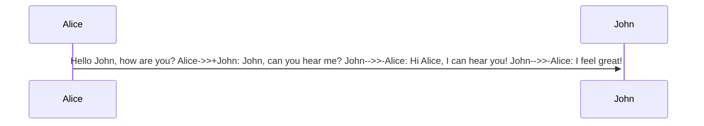

# paragraph : separated by a line

`&nbsp;` : blank space
`<br>` : new line
# heading

![[2023-08-24 11_59_48-Window.png]]


[[2.GreenShot or FlameShot]] for internal links or [wikipedia][https://fr.wikipedia.org/wiki/Windows_Millennium_Edition] for internal and external

<> or 20% if there is aspace in url

>[!note]
>aaka
>aaaa
>

>kskjsdkjsd
>sdsdjksd
>\-me

si `sdjsj` djkdjkd

```djdhjd
dkjsksjdsk
sddjsk if 
for 

endif
```
	jddksdkdsksk 
	sdksks
```js
hjassajhs
asjkas
asjas if for 
```

```java
if for print(sajksa)
```


***

---

-----------

* * *

This is a simple footnote[^1].

[^1]: This is the referenced text.
[^2]: Add 2 spaces at the start of each new line.
  This lets you write footnotes that span multiple lines.
[^note]: Named footnotes still appears as numbers, but can make it easier to identify and link references.


You can also use inline footnotes. ^[This is an inline footnote.]




>[!anything]


To create a heading, add up to six  symbols before your heading text. The number of `#` symbols determines the size of the heading.

To create a heading, add up to six `#` symbols before your heading text. The number of `#` symbols determines the size of the heading.
